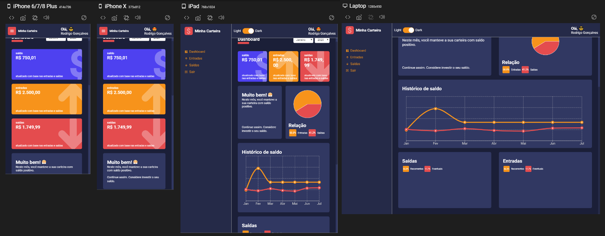

  

Dashboard developed in **ReactJs** with **TypeScript** fully componentized with **pure components**.

  

There is no database. Data is loaded from 2 files containing arrays simulating the data stores.

### Layout and Responsive Components

  

- [x] Link to the prototype developed in [**Figma**](https://www.figma.com/file/nOGmUkhcINJt6nd57R4ENu/Untitled?node-id=0%3A1).

### Layout & Responsive Components

- [x] For the graphics, the library was used [**Recharts**](http://recharts.org/en-US) which is opensource.
- [x] For the effect of growing number I used the [**React CountUp**](https://www.npmjs.com/package/react-countup).

  <small>Instructor: Rodrigo Gonçalves Santana - 2020</small>

  <small>Armindo Malafaia Neto - 2021</small>

- [x] [**Certificate**](https://www.udemy.com/certificate/UC-3b151adf-5141-437e-b5fb-330ac8db84c0/) Link.

- [x] [**URL to Try**](https://minha-carteira-365f4.web.app//). (email: **dm7@dm7sistemas.com.br**, password: **12345678**)

- [x] Implemented Capacitor to create Android and IOS Applications

- [x] Implemented a Progressive Web App (PWA)
